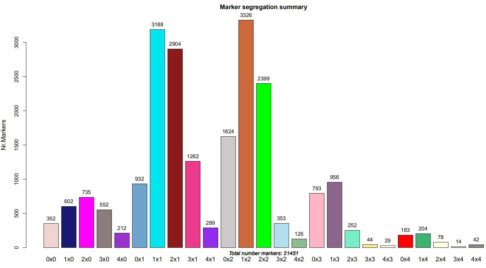
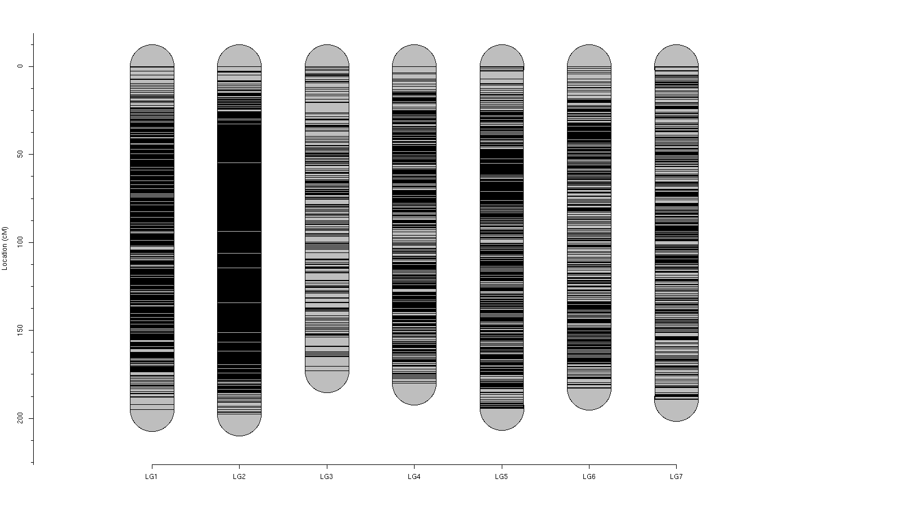
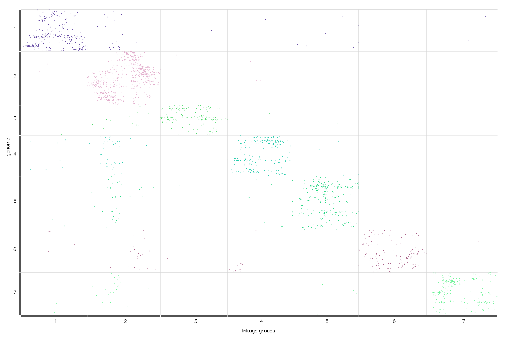

## Polymap workflow


> As the workflow showed that after you calling Variantion and got the VCF file, then you just can using the vcf2dosage.pl (only for tetraploid species) or R package like [PolyRAD](https://github.com/lvclark/polyRAD) and [Updog](https://github.com/dcgerard/updog) to get the dosages matrix, and the last to use the polymapR to construct the genetic mapping. Well, also this pipeline will get the locus mapping file for QTLanalysis. 
## Purpose
**So this pipeline was built to analysis polyploid species genetic mapping. Mostly used the [polymapR](https://cran.r-project.org/web/packages/polymapR/index.html) to create the linkage maps in polyploid species from marker dosage scores of an F1 cross from two heterozygous parents . So, currently works for outcrossing diploid, autotriploid, autotetraploid and autohexaploid species, as well as segmental allotetraploids. The details of Methods, please see the [paper](https://academic.oup.com/bioinformatics/article/34/20/3496/4990829).**

## Installation
#### polymapR
polymapR is available on CRAN at [polymapR](https://cran.R-project.org/package=polymapR). As with other packages on CRAN, it can be installed directly from within R using the command:
```r
> install.packages("polymapR")
```
#### polyRAD 
PolyRAD depends on some Bioconductor packages.  Before attempting to install polyRAD, YOU should run :

```r
if (!requireNamespace("BiocManager", quietly = TRUE)){
  install.packages("BiocManager")
}
BiocManager::install("pcaMethods")
```
and You also should install [VariantAnnotation](https://bioconductor.org/packages/release/bioc/html/VariantAnnotation.html) R package for import from VCF, and run:
```r
BiocManager::install("VariantAnnotation")
```
and then install polyRAD from CRAN with :
```r
install.packages("polyRAD")
```
#### Updog
Updog provides a suite of methods for genotyping polyploids from next-generation sequencing (NGS) data. You can install updog from CRAN in the usual way:
```r
install.packages("updog")
```
or install for the current version from github with :
```r
# install.packages("devtools")
devtools::install_github("dcgerard/updog")
```
#### Others R packages 
```r
install.packages("RColorBrewer")
install.packages("qtl") # https://github.com/kbroman/qtl
install.packages("ASMap") #https://cran.r-project.org/web/packages/ASMap/index.html
install.packages("getopt") # https://cran.r-project.org/web/packages/getopt/index.html
```
### Note : Pipeline was running in Linux environment 

### Some of My Rosa chinensis project genetic mapping results

* Marker segregation summary


* Plotting a map

* Collinearity


#### Contact
If you are interested in this pipeline or using, and met any bug, please feel free to Contact [me](czheluo@gmail.com)
